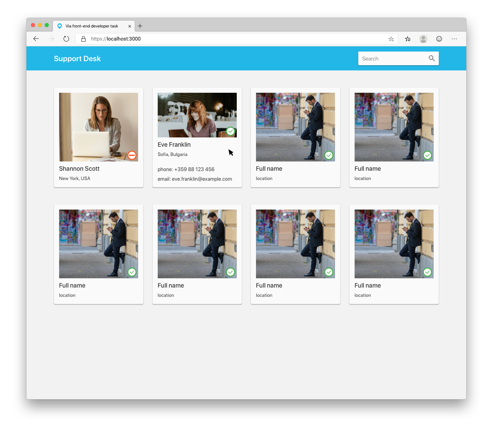

# Support Desk task

## Task

Create a simple Support Desk app that should look similar to the following mockup. Use the [assets/api.json](assets/api.json) file to simulate Web API calls.

## Requirements

- Must be a Single Page App (SPA). Use React, Angular, Vue or a SPA framework of your choice.
- Must be responsive - working on mobile, tablet and desktop.
- Make sure more details come up when you hover person (see the second item).
- Change icon depending on the person's status. Use [assets/icon-available.svg](assets/icon-available.svg) if the person is available, [assets/icon-busy.svg](assets/icon-busy.svg) otherwise. Use [assets/icon-search.svg](assets/icon-search.svg) for the search bar.
- Implement basic search functionality.

Feel free to use a UI library of your choice - Material Design, Bootstrap, Tailwind, etc.

## Criteria

The following are taken into consideration

- Clean and well-organized code
- Architecture
- Code comments (quality, not quantity)
- Tests
- Linters, docs, etc. are a bonus

We are looking for organized scalable frontend code, with attention to details and corner case handling. Show us your eye for detail and consideration for colleagues that will maintain and modify the code.

Please let us know if you have any questions.
